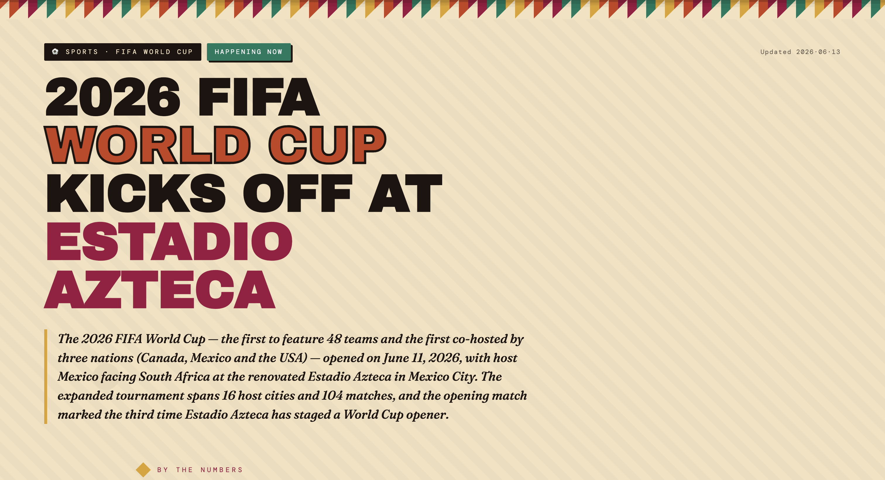
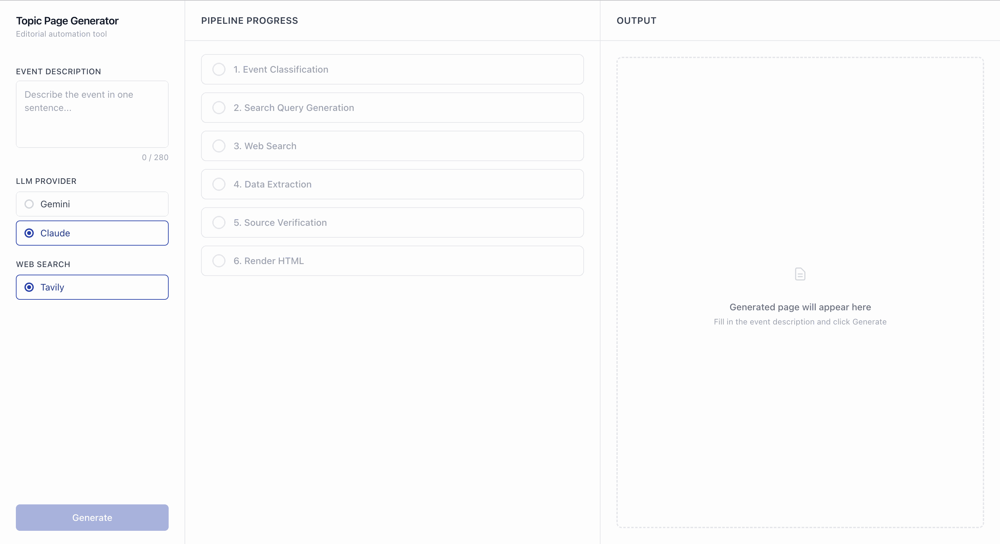

# Topic Page Generator

An internal editorial tool that turns a **one-sentence event description** into a structured, publishable **topic page** — a self-contained HTML page that aggregates context, a timeline, key entities, and cited facts about a breaking or upcoming event.

You type something like *"The 2026 FIFA World Cup kicks off at Estadio Azteca on June 11, 2026."* and the system researches it on the live web, extracts structured data, grades each fact against its sources, and renders a finished page you can download and open in a browser.

The work runs as a six-step pipeline with a clear split between LLM reasoning and deterministic code:

1. **Classify** — detect event type, propose a title, and gate out ambiguous / off-topic / adversarial inputs.
2. **Query generation** — turn the sentence into targeted web-search queries.
3. **Search** — fetch fresh sources via Tavily.
4. **Extract** — pull structured topic-page data, with every fact carrying citations back to its sources.
5. **Verify** — a grounding pass that re-reads each cited excerpt and grades the claim (`confirmed` / `single_source` / `unverified` / `conflicted`).
6. **Render** — produce a self-contained HTML page, then run a deterministic HTML/CSS lint that repairs known LLM failure modes (e.g. content hidden by a broken fade-in animation).

Both **Claude** and **Gemini** are supported as LLM providers (selectable at runtime, each with a model fallback chain), with **Tavily** as the web-search source. See [`docs/DESIGN.md`](docs/DESIGN.md) for the product and architecture rationale.

## Demo

**Generated topic page — 2026 FIFA World Cup**



**Web UI walkthrough**



## Prerequisites

- Python 3.11+
- Node.js 18+
- At least one LLM API key (Anthropic or Google)
- A Tavily API key for web search

## Setup

### 1. Enter the project

```bash
cd path-to-the-project/
```

### 2. Configure API keys

```bash
cp backend/.env.example backend/.env
```

Open `backend/.env` and fill in the keys you have:

```
ANTHROPIC_API_KEY=sk-ant-...      # for Claude provider
GOOGLE_API_KEY=AIza...            # for Gemini provider
TAVILY_API_KEY=tvly-...           # for web search (required)
```

You need **at least one LLM key** and the **Tavily key**. The UI lets you pick the LLM provider at runtime.

### 3. Install backend dependencies

```bash
cd backend
python3 -m venv .venv
source .venv/bin/activate
pip3 install -r requirements.txt
```

### 4. Install frontend dependencies

```bash
cd ../frontend
npm install
```

## Running the service

Open two terminal windows.

**Terminal 1 — Backend (FastAPI):**

```bash
cd backend
source .venv/bin/activate
python3 -m uvicorn main:app --reload
```

The API runs at `http://localhost:8000`. On startup it logs which API keys it detected. Key endpoints:

- `POST /generate` — runs the pipeline and streams progress as Server-Sent Events. Accepts `run_id` + `from_step` to resume a previous run from a checkpoint.
- `POST /run/{run_id}/page` — re-render a page from edited topic data (the review/edit flow).
- `GET /run/{run_id}/page/original` — fetch the originally generated page.
- `GET /health` — liveness check.

**Terminal 2 — Frontend (Vite + React):**

```bash
cd frontend
npm run dev
```

Open `http://localhost:5173`. The Vite dev server proxies `/generate` to `http://localhost:8000`, so both must be running.

## Generating a topic page (web UI)

1. Type a one-sentence event description in the input field.
2. Select an LLM provider (Claude or Gemini).
3. Click **Generate Page**.
4. Watch the pipeline run — each step streams its result as it completes.
5. Review the generated page in the right panel; optionally edit the structured data and re-render.
6. Click **Download .html** to save the self-contained file.

### Example inputs

```
OpenAI rolled out GPT-5.5 Instant as the default model in ChatGPT in May 2026.
```
```
Eurovision 2026 is being held in Vienna from May 12 to May 16.
```
```
The 2026 FIFA World Cup kicks off at Estadio Azteca on June 11, 2026.
```

## Project structure

```
project-root/
├── backend/
│   ├── main.py              # FastAPI app: /generate SSE endpoint + page re-render/fetch
│   ├── pipeline.py          # Orchestrates the 6 steps, streams SSE events, checkpoints each step
│   ├── config.py            # Provider model fallback chains, LLM clients, timeouts, retry logic
│   ├── checkpoints.py       # Per-run output dirs + step checkpoint read/write
│   ├── schemas/
│   │   └── topic_page.py    # Pydantic models for all data types
│   ├── steps/
│   │   ├── classify.py      # Step 1: event classification + input gate
│   │   ├── query_gen.py     # Step 2: search query generation
│   │   ├── search.py        # Step 3: Tavily web search
│   │   ├── extract.py       # Step 4: structured data extraction (with citations)
│   │   ├── verify.py        # Step 5: grounding pass — grades each fact vs. its sources
│   │   ├── render.py        # Step 6: HTML rendering
│   │   └── html_lint.py     # Deterministic post-render HTML/CSS lint + repair
│   ├── requirements.txt
│   └── .env.example
├── frontend/
│   ├── index.html
│   ├── src/
│   │   ├── main.tsx
│   │   ├── App.tsx
│   │   ├── types.ts
│   │   ├── hooks/
│   │   │   └── useGenerate.ts    # SSE streaming + pipeline state
│   │   └── components/
│   │       ├── ConfigPanel.tsx   # input + provider selection
│   │       ├── PipelinePanel.tsx # live step progress
│   │       ├── StepCard.tsx      # per-step result card
│   │       ├── ReviewPanel.tsx   # edit structured data + re-render
│   │       └── OutputPanel.tsx   # page preview + download
│   ├── package.json
│   ├── vite.config.ts           # proxies /generate → localhost:8000
│   ├── tailwind.config.js
│   └── tsconfig.json
├── demo-outputs/
│   ├── html/                    # the 3 built example pages (open directly in a browser)
│   └── gif/                     # demo recordings shown in this README
├── docs/
│   ├── DESIGN.md                # product + architecture rationale
│   └── SPEC.md                  # original challenge brief
└── README.md
```

The three example topic pages required by the spec — spanning different event categories — are the built HTML files in [`demo-outputs/html/`](demo-outputs/html/). Open any of them directly in a browser; no server needed.